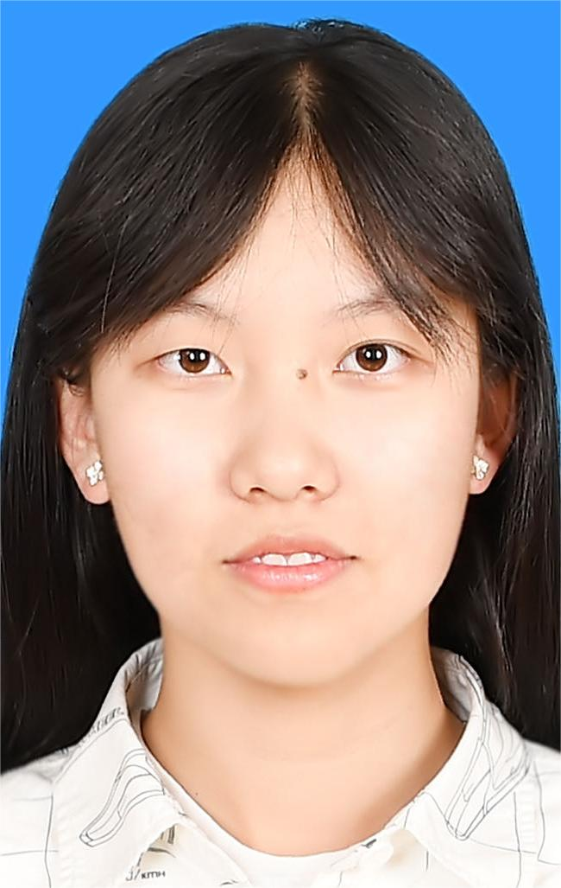

# 韦佳

## 个人介绍

**韦佳**,华中师范大学计算机学院本科生，华大记者团华小诗动漫工作室部委。

## 教育经历
+ 2013-2015年因热爱绘画报名课外绘画兴趣班，初步掌握临摹技巧、光影知识、透视理论、石膏几何体画法。
+ 后因课业繁重，便于课余之时在大型网站搜寻资源，临摹动漫角色，自学绘画技巧。

## 技能特长
+ __iPad电子手绘__
+ 临摹、透视理论
+ *PS软件入门（上）、（下）*
+ _paint软件与电子手绘板使用_

## 荣誉证书
+ __华中师范大学华大记者团华小诗动漫工作室优秀部委聘书__
+ 第十三届大美中国国际书画大赛三等奖
+ 第十四届大美中国国际书画大赛优秀奖

## 自我评价
* 创新精神，细致刻画，做事认真，适应力强，协作精神。
* 色感好，手绘能力强，想象力丰富，乐于吸收新鲜事物。
* 热衷关注动漫周边、游戏、特效科幻电影，并融汇贯通运用到设计上。
* _熟悉角色设计，刊物排版，UI图标绘制，情景插画等。_
*  ...
